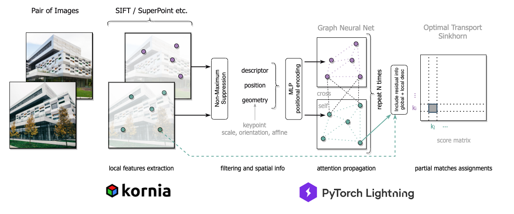

# OpenGlue - Open Source Pipeline for Image Matching


[](https://vshymanskyy.github.io/StandWithUkraine)
[](https://opensource.org/licenses/MIT)


This is an implementation of the training, inference and evaluation scripts for OpenGlue under an open source license, 
our paper - [OpenGlue: Open Source Graph Neural Net Based Pipeline for Image Matching](https://arxiv.org/abs/2204.08870)


## Overview

<p align="center">
  
</p>

SuperGlue - a method for learning feature matching using graph neural network, proposed by a team (Paul-Edouard Sarlin, Daniel DeTone, Tomasz Malisiewicz, Andrew Rabinovich) from Magic Leap.
Official full paper - [SuperGlue: Learning Feature Matching with Graph Neural Networks](https://arxiv.org/abs/1911.11763).

We present OpenGlue: a free open-source framework for image matching, that uses a Graph Neural Network-based matcher inspired by SuperGlue. We show that including additional geometrical information, such as local feature scale, orientation, and affine geometry, when available (e.g. for SIFT features), significantly improves the performance of the OpenGlue matcher. We study the influence of the various attention mechanisms on accuracy and speed. We also present a simple architectural improvement by combining local descriptors with context-aware descriptors. 

This repo is based on [PyTorch Lightning](https://www.pytorchlightning.ai/) framework and enables user to train, predict and evaluate the model.

For local feature extraction, our interface supports [Kornia](https://github.com/kornia/kornia) detectors and descriptors along with our version of [SuperPoint](https://arxiv.org/abs/1712.07629). 

We provide an instruction on how to launch training on [MegaDepth](https://www.cs.cornell.edu/projects/megadepth/) dataset and test the trained models on [Image Matching Challenge](https://www.cs.ubc.ca/research/image-matching-challenge/current/).


## License
This code is licensed under the MIT License. Modifications, distribution, commercial and academic uses are permitted.
More information in LICENSE file.


## Data
### Steps to prepare MegaDepth dataset for training
1) Create folder `MegaDepth`, where your dataset will be stored.
   ```
   mkdir MegaDepth && cd MegaDepth
   ```
2) Download and unzip `MegaDepth_v1.tar.gz` from official [link](https://www.cs.cornell.edu/projects/megadepth/dataset/Megadepth_v1/MegaDepth_v1.tar.gz).
You should now be able to see `MegaDepth/phoenix` directory.
3) We provide the lists of pairs for training and validation, [link](https://drive.google.com/file/d/1DQl6N1bKEdzlRteCVMS1bWffz0SU-L9x/view?usp=sharing) to download. Each line corresponds to one pair and has the following structure:
```
path_image_A path_image_B exif_rotationA exif_rotationB [KA_0 ... KA_8] [KB_0 ... KB_8] [T_AB_0 ... T_AB_15] overlap_AB
```
`overlap_AB` - is a value of overlap between two images of the same scene, it shows how close (in position transformation) two images are. 

The resulting directory structure should be as follows:
```
MegaDepth/
   - pairs/
   |   - 0000/
   |   |   - sparse-txt/
   |   |   |    pairs.txt
      ...
   - phoenix/S6/zl548/MegaDepth_v1/
   |   -0000/
   |   |   - dense0/
   |   |   |   - depths/
   |   |   |   |   id.h5
                 ...
   |   |   |   - images/
   |   |   |   |   id.jpg
                 ...
   |   |   - dense1/
            ...
      ...
```

### Steps to prepare Oxford-Paris dataset for pre-training
We also release the open-source weights for a pretrained OpenGlue on this dataset. 


## Usage

This repository is divided into several modules: 
* `config` - configuration files with training hyperparameters 
* `data` - preprocessing and dataset for MegaDepth
* `examples` - code and notebooks with examples of applications 
* `models` - module with OpenGlue architecture and detector/descriptors methods
* `utils` - losses, metrics and additional training utils

### Dependencies
For all necessary modules refer to requirements.txt
```
pip3 install -r requirements.txt
```

This code is compatible with Python >= 3.6.9
* PyTorch >= 1.10.0
* PyTorch Lightning >= 1.4.9 
* Kornia >= 0.6.1
* OpenCV >= 4.5.4

## Training

### Extracting features
There are two options for feature extraction:
1) Extract features <b>during training</b>. No additional steps required before <b><i>Launching training</i></b>.


2) Extract and save features <b>before</b> training. We suggest using this approach, since training time is decreased immensely with pre-extracted features. Although this step is disk memory expensive.
To do this, run `python extract_features.py` with the following parameters (for more details, please, refer to module's documentation):
      
   * `--device` - `[cpu, cuda]`
   * `--num_workers` - number of workers for parallel processing. When cpu is chosen, assigns the exact amount of the set workers, for gpu scenario it takes into account the number of gpu units available. 
   * `--target_size` - target size of the image (WIDTH, HEIGHT).
   * `--data_path` - path to directory with scenes images
   * `--output_path` - path to directory where extracted features are stored
   * `--extractor_config_path` - 'path to the file containing config for feature extractor in .yaml format
   * `--recompute` - include this flag to recompute features if it is already present in output directory
   * `--image_format` - formats of images searched inside `data_path` to compute features for, default: [jpg, JPEG, JPG, png]
   
   Choosing local feature extractor is performed via `--extractor_config_path`. 
   We provide configs in `config/features/`, which user can edit or use unchanged:
   * SuperPoint with MagicLeap weights - [`superpoint_magicleap.yaml`](config/features/superpoint_magicleap.yaml)
   * SuperPoint with KITTI weights - [`superpoint_kitti.yaml`](config/features/superpoint_kitti.yaml)
   * SuperPoint with COCO weights - [`superpoint_coco.yaml`](config/features/superpoint_coco.yaml)
   * SIFT opencv - [`sift_opencv.yaml`](config/features/sift_opencv.yaml)
   * DoG-AffNet-HardNet - [`dog_opencv_affnet_hardnet.yaml`](config/features/dog_opencv_affnet_hardnet.yaml)

### Launching training

Before training, set all necessary hyperparameters configurations in your config file.
If you selected to extract features during training, then edit [`config/config.yaml`](config/config.yaml). For pre-extracted features `config/config_cached.yaml` will be used.


The description of possible configurations for training is provided in [`CONFIGURATIONS.md`](CONFIGURATIONS.md)


Be aware, that default configs for feature extraction set a maximum of 1024 keypoints per image. For second option - pre-extraction, more keypoints are detected and saved.
When calculating features during training, one of the corresponding configs from [`config/features_online`](config/features_online) should be selected and forwarded as a parameter, see example below. So, there is a great difference between launching with config.yaml or config_cached.yaml .


<b>To launch train with local feature extraction throughout training, run: </b>  
```
python train.py --config='config/config.yaml' --features_config='config/features_online/sift.yaml'
```
sift.yaml is an example, can be any config file from `config/features_online`. <i>Important Note: </i> DoG-AffNet-HardNet is only available for cached features run. We do not recommend extracting features with this model during training.


<b>To launch train with cached local features, run: </b>   
```
python train_cached.py --config='config/config_cached.yaml'
```
The parameter responsible for configuring cached features location is `features_dir`.


The logging results will be visible inside a log folder + experiment name, specified in `config.yaml`. 

### Pretrained models
Our checkpoints are available in this [folder](https://drive.google.com/drive/folders/1N-x_-KzSFgCVO58YeCA3B6AHC2n8JK9J?usp=sharing).
Some other weights might be added in the future. 

## Testing
Example of how to run inference and receive visualizations is shown in [`Image-matching.ipynb`](examples/Image-matching.ipynb).

To run inference on two images and receive a visualization of resulting matches, please use [inference.py](inference.py)

```angular2html
python inference.py --image0_path '926950353_510601c25a_o.jpg' --image1_path '91582271_7952064277_o.jpg' --experiment_path 'SuperPointNet_experiment' --checkpoint_name 'superglue-step=999999.ckpt' --device 'cuda:0 --output_dir 'results.png'
```

To use inference scripts in your code, please take a look at run_inference function in [inference.py](inference.py), which returns `img0, img1, lafs0, lafs1, inliers`.


## Credits
This implementation is developed by [Ostap Viniavskyi](https://github.com/ostapViniavskyi) and [Maria Dobko](https://github.com/marichka-dobko) 
as part of the research project at [The Machine Learning Lab](https://apps.ucu.edu.ua/en/mllab/) at Ukrainian Catholic University. 
Contributors and collaborators: [Dmytro Mishkin](https://github.com/ducha-aiki), [James Pritts](https://prittjam.github.io/), and [Oles Dobosevych](https://scholar.google.com/citations?user=Zg-YKKQAAAAJ&hl=uk).

## Citation

Please cite us if you use this code:


```BibTeX
@article{viniavskyi2022openglue
  doi = {10.48550/ARXIV.2204.08870},
  author = {Viniavskyi, Ostap and Dobko, Mariia and Mishkin, Dmytro and Dobosevych, Oles},
  title = {OpenGlue: Open Source Graph Neural Net Based Pipeline for Image Matching},
  publisher = {arXiv},
  year = {2022}
}
```
